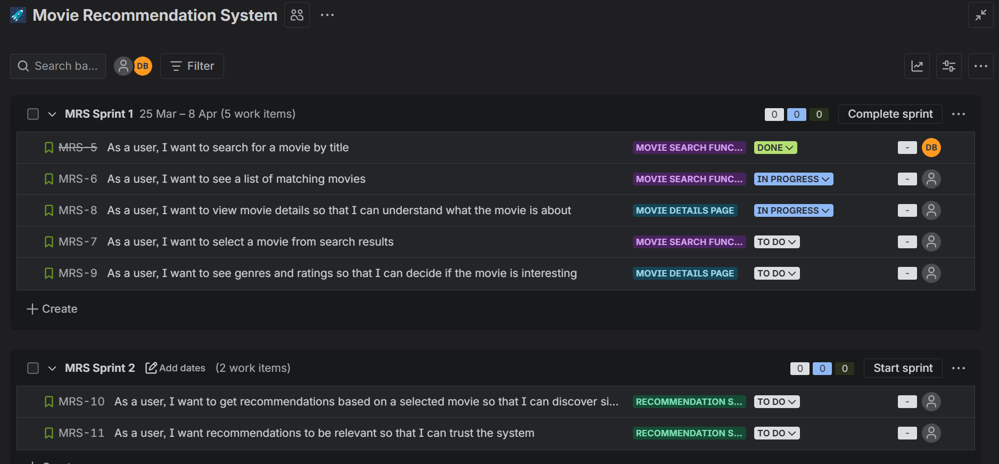
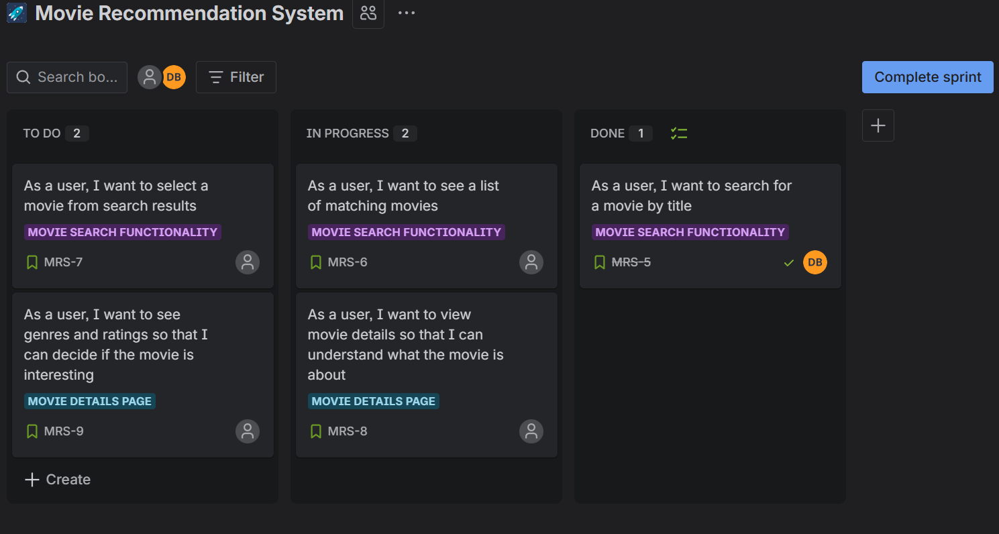
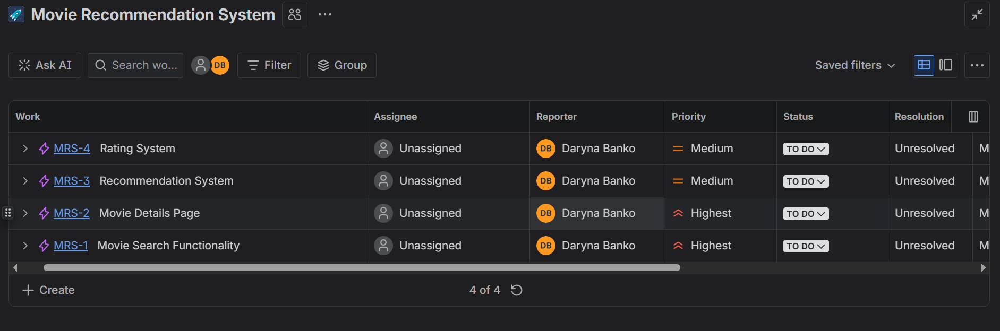
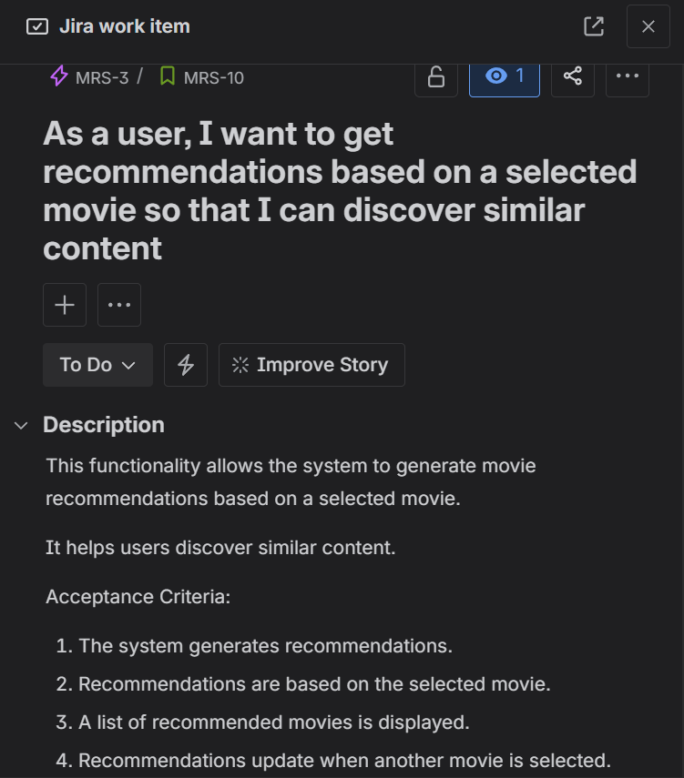
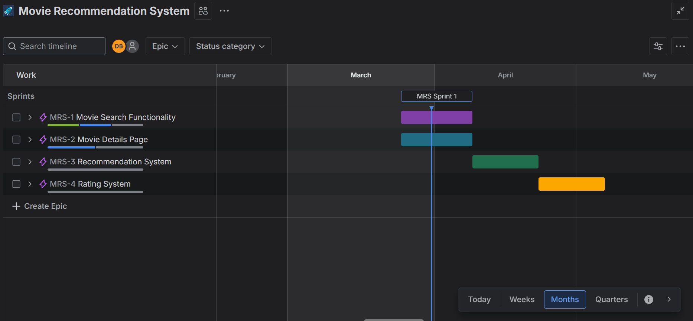

# 🎬 Movie Recommendation App (Case Study)

This is a portfolio case study for a movie recommendation web app focused on solving one problem: helping users find relevant movies faster.

## 👩‍💼 Role and contributions

Role: Business Analyst / Project Coordinator

In this project, I:

- Defined product requirements and MVP scope
- Translated requirements into user stories and acceptance criteria
- Structured and prioritized the backlog in Jira
- Planned delivery timeline and milestones
- Aligned product documentation and execution artifacts

## 🧩 Project overview

Streaming platforms offer huge catalogs, but discovery is often slow and frustrating.  
This case study proposes a content-based recommendation app that suggests relevant movies using metadata and user feedback.

## ✅ Core MVP features

- Search movies by title
- View movie details (description, genres, rating)
- Get recommendations based on selected movie
- Rate movies from 1 to 5 stars

## 🛠️ Tools and technologies

### Product planning
- Jira (backlog, epics, stories, progress tracking)
- Notion (product documentation)
- GanttPRO (roadmap and milestone planning)

### Implementation approach (planned)
- Frontend: React + Vite
- Backend: FastAPI or Flask
- Recommendation engine: pandas + scikit-learn (TF-IDF and cosine similarity)
- Data storage: SQLite or PostgreSQL

## 📊 Jira workflow snapshots

The screenshots below show how requirements moved from planning to delivery.

### Backlog and epic structure

### Sprint planning

### Board execution (work in progress)

### User story quality (description + acceptance criteria)

### Timeline and roadmap view

